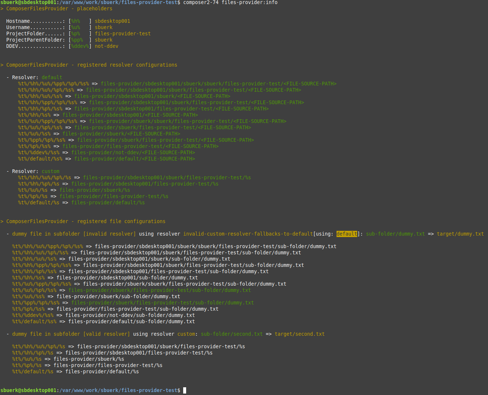

[](https://github.com/sbuerk/composer-files-provider/actions/workflows/ci.yml)

# Composer Files Provider

This plugin acts as composer plugin in order to provide files in a installation
aware manner. This means, that it searches in a configured boilerplate folder
structure in a defined order for files, based on installation placeholders. To
see how this works see corresponding section.

The behaviour of this plugin can be influenced by configuration in the `extra`
section of the root `composer.json`. See section `options` for available options.

## How does this work ?

@todo

## Installation

Simply add this package as a dependency:

```shell
$ composer require sbuerk/composer-files-provider
```

The plugin starts working directly. That means, if you have already provided the needed
configuration it will processed directly. See the Info Command section to get more info
about the current configuration and what may be matched or not.

## Options

Example configuration:

```json
{
  "extra": {
    "sbuerk/composer-files-provider": {
      "template-root": "files-provider/",
      "resolvers": {
        "custom": [
          "%t%/%h%/%u%/%p%/%s",
          "%t%/%h%/%p%/%s",
          "%t%/%u%/%s",
          "%t%/%p%/%s",
          "%t%/default/%s"
        ]
      },
      "files": [
        {
          "label": "env based logo file",
          "source": "images/logo.png",
          "target": "images/logo.png",
          "resolver": "custom"
        },
        {
          "label": ".htaccess",
          "source": "public/.htaccess",
          "target": "public/.htaccess"
        }
      ]
    }
  }
}
```

@todo Add detailed information about the configuration structur and possiblities.

## Info command

This package extends composer with a command to get some insights in the configuration
and what may happen:

```shell
$ composer 
```

which displays something like that:



## Available Placeholders

| short  | description                                                             |
|--------|-------------------------------------------------------------------------|
| %s%    | This will be replaced with the corresponding file block 'source'        |
| %t%    | This will be replaced with the configured template folder               |
| %h%    | This will be replaced with the hostname                                 |
| %u%    | This will be replaced with the username                                 |
| %p%    | This will be replaced with the project folder name                      |
| %pp%   | This will be replaced with the parent folder name of the project folder |
| %ddev% | If processed in DDEV container, this will be replaced with "ddev"       |

## Feedback / Bug reports / Contribution

Bug reports, feature requests and pull requests are welcome in the GitHub
repository: <https://github.com/sbuerk/composer-files-provider>
